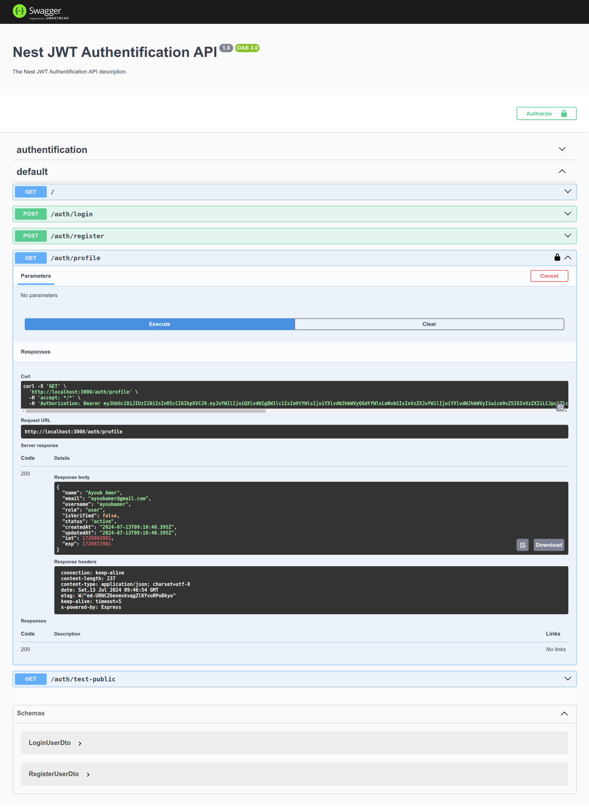

# NestJS JWT Auth API

This project is a small NestJS API for JWT authentication. It uses MongoDB as the database and Swagger for API documentation. This project was created to get familiar with using NestJS for JWT authentication.

## Features

- JWT Authentication
- MongoDB for data storage
- Swagger for API documentation

## Installation

**Clone the repository**

```bash
 git clone https://github.com/ayoubbuoya/nestjs-jwt-auth.git
 cd nestjs-jwt-auth
```

**Install dependencies**

```bash
$ pnpm install
```

**Set up environment variables**

Create a `.env` file in the root directory and add the following environment variables:

```env
MONGODB_URI=<your-mongodb-uri>
JWT_SECRET=<your-jwt-secret>
```

## Running the app

```bash
# development
$ pnpm run start

# watch mode
$ pnpm run start:dev

# production mode
$ pnpm run start:prod
```

## Usage

Once the application is running, you can access the API documentation at `http://localhost:3000/api`.

## API Documentation

Swagger is used to document the API. Below is a demo picture of the Swagger UI of our API :


